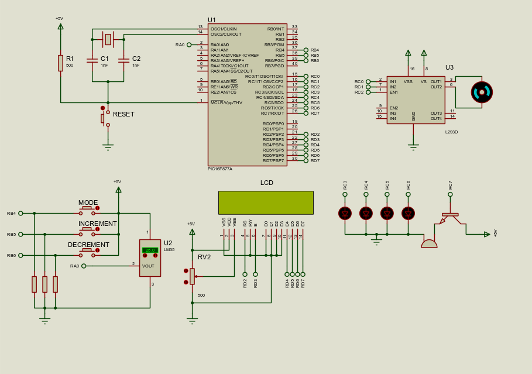

# PIC16F877A Motor-dependent AC Temperature Controller

## DESCRIPTION - To do

## COMPONENTS LIST
| Components     | Quantity   |
| ------------- |:--:|
| PIC16F877A | 1 |
| LM35 | 1 |
| L293D | 1 |
| DC Motor | 1 |
| 20 Mhz Crystal Oscillator | 1 | 
| 16x2 LCD | 1 |
| Buzzer | 1 |
| BJT Transistors | 1 |
| 1nF Capacitors | 2 | 
| LED | 4 |
| SPST Switch | 4 |
| 500Ω Resistors | 4 |

